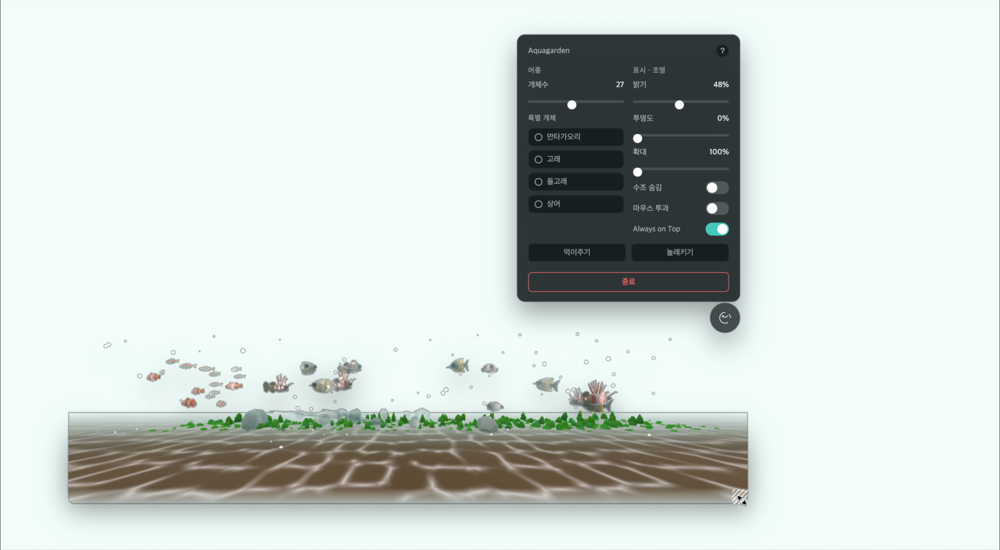

# 🐠 Aquagarden

화면 상단에 가로 바 형태로 떠 있는 **데스크톱 오버레이 위젯**. 다른 작업을 하는 동안에도
항상 위에 떠 있고 바탕화면이 투과되어 비치는, 미니멀한 3D 수족관입니다. 힐링용 위젯이라
유휴 시 CPU/GPU 점유를 0에 가깝게 유지합니다.

- **Electron**(투명·always-on-top·click-through 창) + **Three.js**(WebGL 3D) + **TypeScript** + **Vite**
- 숨김 상태에선 렌더 루프를 멈춰 절전, 물고기는 풀링으로 재사용



## 🎬 데모


> 위 GIF는 13초 하이라이트입니다. 더 선명한 **40초 HD 워크스루**(개체수·밝기·특별 개체·확대·마우스 투과)는
> [`docs/media/demo.mp4`](docs/media/demo.mp4)에 있습니다. (GitHub README 편집기에 이 `demo.mp4`를
> 드래그&드롭하면 인라인 영상 플레이어로도 넣을 수 있습니다.)

## ✨ 주요 기능

- **기본 어종 5종**(네온테트라 2종·흰동가리·나비고기·쏠배감펭, CC0 GLB) — 원본 본 클립을 재생하는 스켈레탈 애니메이션 + boids 군집
- **바닥 청소부 새우** — 블렌더로 만든 아마노 새우(스켈레탈 애니메이션). 다른 어종과 달리 **바닥에 붙어 수평으로 종종거리는(멈칫→전진) 고유 거동**으로 작게 거닙니다. 개체수 풀에 섞여 등장
- **특별 개체 4종** — 만타가오리·고래·돌고래·상어. 패널에서 개별로 켜면 등장하고 기본 군집보다 크게 헤엄칩니다
- **조명** — IBL(환경맵) 기반, 밝기 슬라이더가 조명·환경 강도를 함께 조절
- **수중 분위기** — 절차적 커스틱(모래·물고기·돌에 투사), 깊이 틴트, 기포·글로우 스프라이트
- **하드스케이프** — 수초 5종·돌·유목이 바닥을 채우고, 깊이에 따라 먼 바닥이 수중 헤이즈로 자연스럽게 흐려짐
- **인터랙션** — 물고기를 클릭하면 어종별 대사(종마다 10개), 먹이주기/놀래키기 (마우스 투과·수조 숨김 중에는 비활성 표시)
- **확대(줌)** — 마우스 휠 또는 슬라이더로 수조를 1~2배 확대해 물고기를 가까이서 감상
- **창 조작** — 플로팅 버튼 드래그로 이동(여러 모니터에 걸쳐 이동 가능, 작업 영역 밖으로는 안 나감), 모서리 그립으로 크기 조절, 패널 자동 위/아래 열기
- **메뉴바 트레이** — 트레이 아이콘으로 보이기/숨기기·위치 초기화·로그인 시 시작·종료 (버튼을 못 찾아도 복구 가능)
- **설정 자동 저장** — 개체수·밝기·투명도·확대·특별 개체·창 위치/크기가 재시작 후에도 유지됨
- **이용 가이드** — 패널의 `?` 버튼으로 각 컨트롤 사용법 안내

## 🚀 사용 방법

1. 앱을 실행하면 화면 **상단에 가로 수족관 바**가 떠 있고, **우상단에 둥근 플로팅 버튼**이 있습니다.
2. 플로팅 버튼을 **클릭**하면 설정 패널이 열립니다. (아래 공간이 부족하면 위로 열립니다.)
3. 패널에서 개체수·밝기·투명도·확대를 조절하고, **특별 개체**(만타가오리·고래·돌고래·상어)를 켜거나 **먹이주기/놀래키기**를 켠 뒤 화면을 클릭해 물고기와 상호작용합니다.
4. **물고기를 클릭**하면 대사가 나옵니다.
5. 수조 위에서 **마우스 휠**을 굴리거나 패널의 **확대** 슬라이더로 가까이 당겨 볼 수 있습니다.
6. 플로팅 버튼을 **드래그**하면 창을 옮기고, 수조의 **오른쪽·아래·우하단 모서리를 드래그**하면 크기가 바뀝니다.
7. 다른 작업에 방해되면 **마우스 투과**를 켜 수조 영역 클릭이 뒤 화면으로 통과되게 하거나, **수조 숨김**으로 잠시 끌 수 있습니다. (이때는 먹이주기·놀래키기·확대가 비활성화됩니다.)
8. 종료는 패널 하단 **종료** 버튼을 두 번 누릅니다.
9. 사용법이 헷갈리면 패널 우상단의 **`?` 버튼**으로 안내를 볼 수 있습니다.

## 🎛️ 컨트롤 (우상단 버튼 → 패널)

| 항목 | 설명 |
|------|------|
| 개체수 | 헤엄치는 기본 물고기 수 |
| 특별 개체 | 만타가오리·고래·돌고래·상어를 개별로 켜기/끄기 |
| 밝기 | 수조 조명 밝기 |
| 배경 투명도 | 물고기를 제외한 수조(바닥·수초·돌)의 투명도. 0이면 물고기만 |
| 확대 | 마우스 휠 또는 슬라이더로 수조를 1~2배 확대 |
| 수조 숨김 | 렌더링을 멈춰 절전(플로팅 버튼만 남음) |
| 마우스 투과 | 수조 영역 클릭을 뒤쪽 화면으로 통과 |
| Always on Top | 항상 다른 창 위에 표시 |
| 먹이주기 / 놀래키기 | 켠 뒤 화면을 클릭하면 물고기가 반응 |
| 크기 조절 | 수조의 오른쪽·아래·우하단 모서리를 드래그 |
| 종료 | 두 번 눌러 종료 |

> 먹이주기·놀래키기·확대는 **마우스 투과**나 **수조 숨김**이 켜져 있으면 동작할 수 없어 패널에서 비활성(흐리게)으로 표시됩니다.

## 📥 설치 (사용자)

[Releases](https://github.com/outliner-coach/aquagarden-for-builder/releases)에서 OS에 맞는 파일을 받으세요.

> ⚠️ Apple 공증(notarization)이 안 된 무료 배포라 첫 실행에 한 번 우회가 필요합니다.
> - **macOS**: Apple Silicon은 반드시 **`-arm64.dmg`**, 인텔 맥은 `...-x64.dmg`(접미사 없는 dmg)를 받으세요.
>   `응용 프로그램`으로 드래그한 뒤, 첫 실행이 막히면 **영구 해결(권장)** — 터미널에서 한 번:
>   ```bash
>   xattr -dr com.apple.quarantine /Applications/Aquagarden.app
>   ```
>   이후로는 더블클릭으로 바로 열립니다. (터미널이 싫으면 **시스템 설정 → 개인정보 보호 및 보안 →
>   "그래도 열기"** — 단 미공증 앱은 가끔 재승인을 요구할 수 있어 위 방법을 권장.)
> - **Windows**: `.exe` 실행 → SmartScreen에서 **추가 정보 → 실행**.

## 🛠️ 개발

```bash
npm install
npm run dev      # Electron + Vite 개발 모드(창 자동 실행)
npm run build    # 타입체크 + 프로덕션 번들(out/)
npm run lint     # ESLint
npm run test     # Vitest(순수 로직)
npm run smoke    # 빌드 + headless 런타임 eval(셰이더/렌더 깨짐·투과 자동 검증)
```

> 시각 변경 후엔 `build/test/lint` 통과만으로 "표시됨"을 단정하지 말고 `npm run smoke`로 실제 렌더를
> 검증하세요. 자세한 규칙은 [`CLAUDE.md`](CLAUDE.md) 참고.

### 구조
- `src/main/` — OS 창 제어(always-on-top·click-through·이동·크기). **OS 제어는 main에서만.**
- `src/preload/` — `contextBridge` 화이트리스트 IPC만 노출(보안: `nodeIntegration` 미사용)
- `src/renderer/` — Three.js 3D 씬·UI
- `src/shared/` — 공유 타입·상수(`config.ts`)

## 🚀 배포

`v*` 태그를 push하면 GitHub Actions가 macOS·Windows 설치 파일을 빌드해 Releases에 자동 첨부합니다.

```bash
git tag v0.1.0
git push origin v0.1.0
```

자세한 절차·서명 옵션은 [`docs/DEPLOY.md`](docs/DEPLOY.md) 참고.

## 📄 라이선스 / 에셋

물고기 모델은 CC0 GLB 에셋을 사용합니다.
