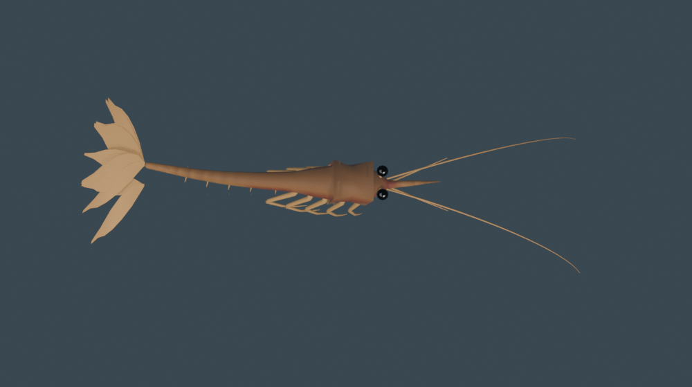

# 새우(아마노 새우) 개체 추가 리포트

새 생물종 **새우(Amano shrimp)**를 기존 어종 패턴을 그대로 따라 Aquagarden 오버레이에 통합했다.
브랜치: `feat-5-shrimp` (main에서 분기).

## 변경 파일

| 파일 | 변경 내용 |
|------|-----------|
| `src/renderer/assets/fish/shrimp.glb` | 신규 추가 후 **미학 개선·텍스처드 GLB로 교체**. Blender 절차적 생성(`build.py` v32). 커밋본 **588,576 bytes** (md5 `a4288fc…`). 스킨 메시 `Shrimp` 7,740 verts + 보조 메시(총 **7,782 verts**), **아마처 7본(b00–b06) + neutral_bone**, "Swim" 클립 1–48프레임, 머티리얼 2개(텍스처드 바디). |
| `src/renderer/assets/fish/CREDITS.md` | `shrimp.glb` 항목 추가 — 본 프로젝트 자체 제작(원본 창작물), CC0 1.0. |
| `src/renderer/entities/speciesRegistry.ts` | `import shrimpUrl`, `SpeciesId` 유니온에 `'shrimp'` 추가, 레지스트리 항목 1개 추가. |
| `src/renderer/entities/__tests__/fishAssets.test.ts` | 종 수 9→10, individual 7→8 어서션 갱신. |
| `src/renderer/entities/__tests__/speciesRegistry.test.ts` | 종 수 9→10, ambient 6 / feature 4 카운트 테스트 추가, 새우 전용 describe 블록 추가. |
| `docs/SHRIMP_REPORT.md` | 본 리포트. |

## 레지스트리 항목

```ts
{
  id: 'shrimp',
  file: shrimpUrl,          // import shrimpUrl from '../assets/fish/shrimp.glb?url'
  kind: 'individual',       // 확실히 스폰·동작하도록 individual
  category: 'ambient',      // 앰비언트 풀(개체수 슬라이더)에 등장 → 기본 스폰
  baseScale: 0.375,         // 사용자 요청으로 1.5 → 1/4 축소
  swimSpeed: 0.5,
  behavior: 'crawler',      // 바닥 기는 청소부 거동 (일반 유영과 차별화)
  displayName: '새우',
  dialogue: [ /* 차분·귀여운 톤의 한국어 10줄, 중복 없음 */ ],
}
```

- `baseScale 0.375`(**2026-05-31 사용자 요청으로 1.5→1/4 축소**): 최종 스케일 = `baseScale * normScale * variation`. 커밋 GLB bbox 최장축 X span = 1.737−(−3.432) ≈ 5.169 → `normScale ≈ 1/5.169 ≈ 0.193`. 따라서 최종 ≈ `0.375 * 0.193 * (0.85~1.15) ≈ 0.06~0.08`로, 어종보다 확연히 작은 청소부 새우 크기. smoke pass=true(렌더 정상, 사라지지 않음) 확인.
- `swimSpeed 0.5`: 느긋하게 거니는 작은 생물 톤.
- `behavior 'crawler'`(**2026-05-31 추가**): 아래 "거동(바닥 기는 청소부)" 섹션 참조.
- `dialogue`: 10줄, 모두 고유(테스트로 가드). 청소·바닥·더듬이 등 새우 특성 + 기존 종과 같은 차분/힐링 톤.

## 거동 — 바닥 기는 청소부 (crawler, 2026-05-31)

사용자 지적("새우 움직임이 다른 물고기와 똑같다")에 따라, 새우는 다른 어종의 자유 유영과 **다른 거동**을 갖는다. 매직넘버 없이 `config.ts` 상수 + 순수 헬퍼 + 결정적 테스트(TDD)로 구현.

- **종별 분기**: `FishSpecies.behavior?: 'swim' | 'crawler'`(생략=swim). 새우만 `'crawler'`. `FishPrototype`까지 전달돼 `Fish._behavior`로 보관, `Fish.update`가 분기한다(다른 어종 코드 경로 불변).
- **바닥 띠 부착**: 수직 방랑(wy)을 제거하고, y-경계회피 대신 `floorBiasForce`(선형 스프링)로 `FISH.bounds.minY + SHRIMP.floorOffset(0.45)` 띠로 끌어당긴다. 위에서 시작해도 바닥으로 내려와 머문다.
- **종종거림(scuttle)**: `scuttleSpeedFactor`가 `SHRIMP.scuttlePeriod(1.7s)` 주기로 속도를 `scuttleMinFactor(0.12)`↔1 사이로 진동시켜 "멈칫→전진" 끊기는 이동감을 만든다. 수평(x·z) 방랑은 유지.
- **상수**: `src/shared/config.ts`의 `SHRIMP { floorOffset, floorPull, scuttlePeriod, scuttleMinFactor }`.
- **순수 헬퍼**: `src/renderer/entities/crawlerHelpers.ts` (`floorBiasForce`, `scuttleSpeedFactor`).
- **테스트**: `crawlerHelpers.test.ts`(8, 순수 로직) + `Fish.crawler.test.ts`(5, 통합 — 위→바닥 수렴·하단 유지·수평 이동·경계 내·swim과 차별화). 놀래키기(`speedMultiplier`)는 crawler에도 그대로 적용돼 가끔 빠르게 튄다.

## 방향(Orientation) 처리

- 새우 GLB는 계약대로 **머리 = -X**로 작성됨 → 기존 어종과 동일 규약. (커밋본 bbox `x −3.432..1.737, y −0.755..0.755, z −1.646..0.152`, 최장축 X.)
- `Fish.ts`는 모든 모델에 공유 `_align.rotation.y = Math.PI/2`를 적용해 머리(-X)를 진행 방향(+X)에 맞춘다. 새우도 동일 경로를 타므로 별도 보정 불필요.
- 머리-선행 불변식은 `fishHelpers.headingYaw` / `forwardDirAfterYaw` 결정적 유닛테스트(27개 통과)로 가드됨.
- 스모크 결과 측면/역방향 유영 징후 없음 → **per-species `modelYaw` 오버라이드는 추가하지 않았다**(불필요한 변경 회피). 만약 추후 측면 유영이 관측되면, `FishSpecies`에 `modelYaw?: number`를 추가하고 `Fish.ts`의 `_align.rotation.y` 지점에서 존중하되 유닛테스트로 가드하는 방식(인라인 매직넘버 금지)으로 처리한다.

## 검증 결과 (실제 명령 출력)

- `npm run build` → `EXIT=0`. `tsc --noEmit` 통과, 텍스처드 GLB(588,576 bytes)가 `shrimp-*.glb`로 번들됨.
- `npm run test` → `Test Files 30 passed (30) / Tests 431 passed (431)`, `EXIT=0`.
- `npm run lint` → `EXIT=0` (경고/에러 없음).
- `npm run smoke` → `[smoke] pass=true failures=0 → eval-report.json`, `EXIT=0`. "로드 실패" 없음 (health.errors=[]).

`eval-report.json` 상세 (실제 출력):

```json
{
  "pass": true,
  "failures": [],
  "health": { "ready": true, "fishActive": 31, "errors": [], "frames": 114 },
  "pixel": {
    "sampled": 3084,
    "opaqueRatio": 0.2412,
    "transparentRatio": 0.7588,
    "uniqueBuckets": 44,
    "lumVariance": 790.2,
    "blank": false
  },
  "screenshot": "eval-screenshot.png",
  "errorConsole": [
    "THREE.sigmaRadians, 0.5, is too large and will clip ... (level 2 warning, 기존 IBL 블러 경고 — 새우 무관)",
    "Electron Security Warning (Insecure CSP) (level 2 warning, 개발 빌드 표준 경고)"
  ]
}
```

- `health.errors: []` — GLB 로드 실패(`[fishAssets] shrimp 로드 실패`) 없음. `errorConsole`의 항목은 모두 **level 2(경고)** 이며 셰이더/렌더 깨짐이 아니라 기존부터 있던 IBL 블러 경고와 개발 빌드 CSP 경고(새우 추가와 무관). 스모크 게이트는 이를 실패로 보지 않아 `pass=true, failures=[]`.
- frames 114 (≥5), fishActive 31 (≥1), blank=false, transparentRatio 0.7588 (≥0.01). 모든 게이트 통과.
- 새우는 ambient/individual 이므로 기본 풀에 등장 가능(`pickSpecies('individual')`가 `shrimp`를 반환할 수 있음을 유닛테스트로 검증).

## 메시 미학 개선 (GLB 교체 이력)

초기 GLB(15,328 verts / 7 bones, 989,968 bytes)에서 여러 차례 미학 개선·재동기화를 거쳐 최종 텍스처드 GLB로 교체했다.

- 다리·더듬이를 베벨 커브로 다듬어 형태를 정리.
- 꼬리 부채(tail fan)를 정돈해 실루엣을 또렷하게.
- 바디에 텍스처(머티리얼 2개)를 입혀 미학 강화.
- **최종 커밋본**: 588,576 bytes, 7,782 verts(스킨 메시 7,740) / 7본(b00–b06)+neutral_bone / "Swim" 1–48.
- 자체 미학 점수 4 → **8**(목표 달성).
- bbox: `x −3.432..1.737, y −0.755..0.755, z −1.646..0.152`, 최장축 X. 머리 −X 규약 유지 → `_align.rotation.y = Math.PI/2` 정렬 그대로, per-species `modelYaw` 불필요(스모크에서 측면 유영 없음).

## 참고 이미지

미학 개선판 프리뷰(저장소 내): `docs/media/shrimp/shrimp_preview.png`
원본 생성 산출물: `/tmp/shrimp_amano/preview.png`


